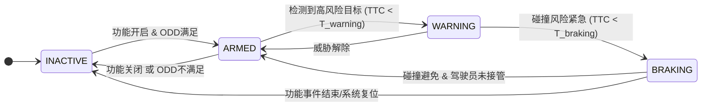

# 功能规范：防止前方车辆横穿 (AEB-CT)

## 1. 功能概述

防止前方车辆横穿 (AEB-CT, Autonomous Emergency Braking - Crossing Traffic) 是一项高级驾驶辅助系统 (ADAS) 安全功能。当自车 (Ego) 在路口直行时，该系统旨在检测从侧方横向穿过的目标车辆 (GVT, General Vehicle Traffic)，并在预测到碰撞风险时，通过发出预警和/或主动紧急制动来避免或减轻碰撞。

## 2. 定义与术语

- **Ego**: 指装备了本系统的本车（自车）。
- **GVT**: 指在自车行驶路径上，可能与自车发生碰撞的其他交通参与车辆。
- **AEB-CT**: 防止前方车辆横穿（本功能）。
- **ODD**: (Operational Design Domain) 设计运行域，指本功能设计时所预设的可运行的特定环境和条件。
- **TTC**: (Time to Collision) 碰撞时间，预测的碰撞发生前所剩余的时间。
- **FCW**: (Forward Collision Warning) 前向碰撞预警。

## 3. ODD (设计运行域)

| 参数 | 范围/条件 | 备注 |
| :--- | :--- | :--- |
| **自车速度** | 5 km/h - 60 km/h | 功能在低速和中速城市道路场景下激活。 |
| **GVT速度** | 5 km/h - 60 km/h | - |
| **道路类型** | 城市道路、十字路口、T型路口 | 适用于结构化道路，不支持环岛、停车场等复杂场景。 |
| **天气状况** | 白天，晴天或多云 | 大雨、大雪、大雾、夜晚等能见度低的环境会限制功能表现或导致其退出。 |
| **传感器状态** | 前向毫米波雷达和摄像头工作正常 | 传感器被遮挡、污损或发生故障时，功能不可用。 |

## 4. 场景示意图

**场景描述:**

上图描绘了一个典型的T型路口场景。
- **自车 (Ego)**：正在沿主路垂直向上行驶，接近路口。
- **他车 (GVT 1)**：正在从左侧沿次干道横向驶来，即将进入自车的行驶路径。
- **感知/作用区域**: 蓝色虚线框表示车载传感器（雷达/摄像头）能够有效检测目标的范围。
- **碰撞检测与预测区域**: 橙黄色虚线区域是系统通过融合自车与他车的运动状态（速度、航向角）所预测出的潜在碰撞点。系统将持续监控该区域内的TTC。

## 5. 功能逻辑

### 5.1 感知与目标跟踪

1.  系统通过前向摄像头和毫米波雷达，持续扫描前方感知区域内的移动目标。
2.  对检测到的目标进行分类（车辆、行人等），并稳定跟踪其运动状态（位置、速度、加速度、行驶方向）。

### 5.2 威胁评估

1.  系统筛选出正在横向移动且其预测轨迹将与自车未来行驶轨迹相交的目标车辆(GVT)。
2.  对于筛选出的每一个潜在威胁目标，系统将计算其与自车的**碰撞时间 (TTC)**。
3.  只有当目标车辆同时满足以下条件时，才被视为**高风险目标**：
    -   被分类为机动车。
    -   横向移动速度在ODD范围内。
    -   预测的TTC小于预设的**预警时间阈值 (T_warning)**。

### 5.3 决策与执行

1.  **预警 (Warning)**：当检测到高风险目标，且其TTC小于 `T_warning` 但大于 `T_braking` (紧急制动时间阈值) 时，系统触发**一级预警**（如声音提示、仪表盘图标闪烁），提醒驾驶员注意。
2.  **紧急制动 (Braking)**：当TTC持续减小并小于 `T_braking` 时，系统判定碰撞即将发生，将自动启动紧急制动，以最大减速度刹车，尽可能避免碰撞或降低碰撞损害。
3.  **退出与抑制**：
    -   如果驾驶员有明确的控制行为（如深踩油门、大幅度转动方向盘），系统将抑制或退出制动。
    -   如果目标车辆的威胁解除（如对方减速、停车或已穿过碰撞点），系统将解除预警和制动，恢复正常行驶。

## 6. 功能状态机

